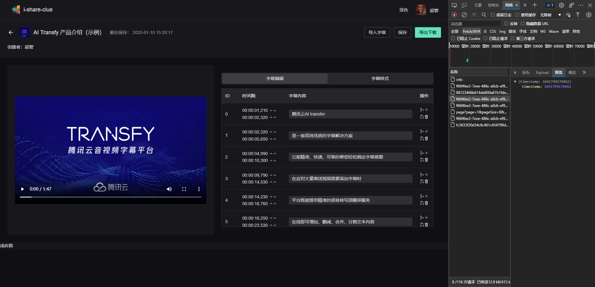
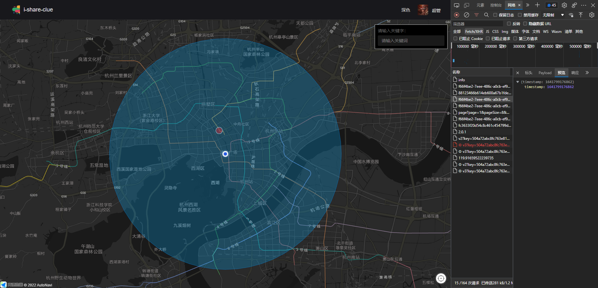
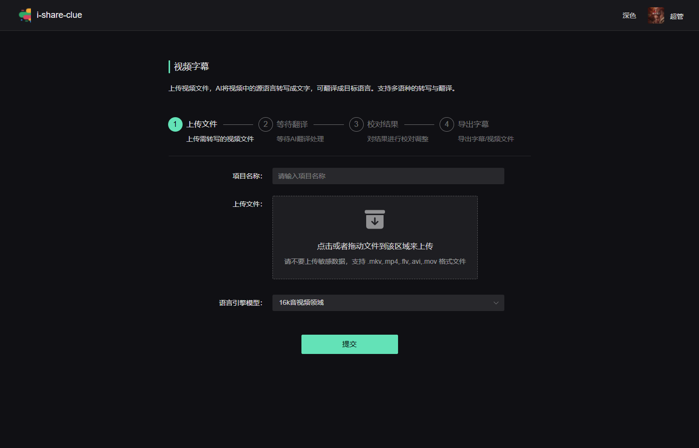

# 线索分享平台 + 字幕转译功能

## 项目截图







## 技术栈

- POSTGIS gis
- vue.js@3 typescript framework
- naive-ui@2 ui
- postgres database
- @nestjs backend
- AMap@2 gis-show
- minio file-save-server
- docker build
- 腾讯云 API

## 开发工作

- 开发之前你可能需要安装 `pnpm`

```bash
npm i -g pnpm
# 未预装 Node.js
# 在 POSIX 系统上，即使您没有安装 Node.js，您也可以使用以下脚本安装 pnpm：
curl -fsSL https://get.pnpm.io/install.sh | sh -

#如果您没有安装 curl，也可以使用 wget：
wget -qO- https://get.pnpm.io/install.sh | sh -

# 在 Windows 下（使用PowerShell）：
iwr https://get.pnpm.io/install.ps1 -useb | iex

# 已预装 Node.js
在 Linux 或 macOS 下：
curl -f https://get.pnpm.io/v6.16.js | node - add --global pnpm

在 Windows 下（使用PowerShell）：
Invoke-WebRequest 'https://get.pnpm.io/v6.16.js' -UseBasicParsing -o pnpm.js; node pnpm.js add --global pnpm; Remove-Item pnpm.js
```

### 必会遇到的 BUG(如果用 yarn 就不会有这个问题)

```
node_modules\.pnpm\registry.npmmirror.com+cos-nodejs-sdk-v5@2.11.6\node_modules\cos-nodejs-sdk-v5\index.d.ts
```

Body 类型找不到
只要在上面加上 @ts-ignore 即可

```
// @ts-ignore
Body?: Body | string,
```

### 可能工作（在根目录执行）

1. 同步前后端枚举配置

```
pnpm enums:sync
```

2. 添加 data 目录

```
pnpm make:dir
```

### 后端

1. 配置后端文件

```bash
cp .env.example .env
```

如果需要使用字幕转译功能, 需要配置腾讯云 API

2. 下载 `docker@4.2` 并设置相应镜像

3. 安装与运行 `redis`

```bash
docker run --name redis1 -p 6379:6379  -d redis
```

3. 安装 `minio`

```bash
docker pull minio/minio:latest
```

4. 运行 `minio`

```
docker run -p 9000:9000 -p 9001:9001 --name minio1 -d -e "MINIO_ROOT_USER=admin" -e "MINIO_ROOT_PASSWORD=qwertyuiop123456" minio/minio server /data --console-address ":9001"
```

5. 登录 minio 创建 `test` bucket, 并将权限设置为 `public`

6. 安装运行 `postgis` 与 `pgadmin`

```bash
docker run --name postgis -d -p 5432:5432 -e POSTGRES_PASSWORD=postgres -d postgis/postgis

docker run --name pgadmin -d -p 5433:80 -e PGADMIN_DEFAULT_EMAIL=root@root.com -e PGADMIN_DEFAULT_PASSWORD=123456 dpage/pgadmin4
```

7. 登录 `pgadmin` 连接 `pgsql` 记得 ip 是 `host.docker.internal`

8. 检查与建立数据库 `zhoushan` 默认

9. 执行迁移

```
pnpm migrate
```

10. 同步数据结构

```
pnpm schema:sync
```

11. 执行种子发生器

```
pnpm seed
```

12. 运行开发模式

```
pnpm start
```

### 前端

1. 安装包

```
pnpm i
```

2. 注册高德地图 key

```sh
# 高德地图 key 填入 `.env.local`
cp .env .env.local
```

3. 运行开发模式

```
pnpm dev
```

## 目的

提供线索
互帮互助

## 进程

1. 简单权限设定
1. 简单用户信息设定
1. 线索位置添加
1. 线索位置搜索
1. 用户管理 CRUD
1. 视频字幕功能添加
1. 字幕生成功能

## 待完成

1. "大标题"为固定枚举类
1. 用户自定义"大标题"颜色
1. "分类功能"为固定枚举类
1. 字典功能
1. 线索与项目生成关联与讨论
1. 打赏与线索更新机制讨论
1. 字幕画面与调整功能

## 简单案例

### 1. 停车场信息分享

告诉附近停车场具体信息，与不知名停车场分享，得到帮助者可以通过二维码打赏

### 2. 小道招聘信息

### 3. 车辆接送信息

```
具有简单的权限系统与文件上传, 并主要用GIS开发地图上的线索分享系统

Simple permission system and file uploading, and lead sharing system on maps developed mainly with GIS
```

## Stat


